# Robot Software Architecture — Demacia 5635

> **Who this is for:** team members who are about to write the **next version** of the robot code.
> You should know basic Java (classes, interfaces, `extends` / `implements`). You do **not** need to
> know WPILib in depth — the important ideas are explained below.
>
> **How to read it:** sections 1–3 give the big picture. Sections 4–9 go deep into each part.
> Section 10 lists what is broken or awkward today, and section 11 suggests how to do it better
> in the new version.

---

## Table of contents

1. [What is in this repository?](#1-what-is-in-this-repository)
2. [The big picture — layers](#2-the-big-picture--layers)
3. [How the robot program runs](#3-how-the-robot-program-runs)
4. [Hardware layer: motors and sensors](#4-hardware-layer-motors-and-sensors)
5. [Mechanisms: building a subsystem in a few lines](#5-mechanisms-building-a-subsystem-in-a-few-lines)
6. [The swerve chassis](#6-the-swerve-chassis)
7. [Where is the robot? — pose estimation and vision](#7-where-is-the-robot--pose-estimation-and-vision)
8. [Logging and telemetry](#8-logging-and-telemetry)
9. [Other utilities](#9-other-utilities)
10. [Known problems in the current code](#10-known-problems-in-the-current-code)
11. [Recommendations for the new version](#11-recommendations-for-the-new-version)
12. [Glossary](#12-glossary)

---

## 1. What is in this repository?

This repo has two parts:

| Part | Folder | What it is |
|------|--------|------------|
| **Robot template** | `src/main/java/frc/robot/` | An almost empty WPILib command-based robot (`Main`, `Robot`, `RobotContainer`, `Constants`). This is where **season-specific** code goes. |
| **Demacia library** | `src/main/java/frc/demacia/` | ~90 Java files of **reusable** code: motors, sensors, swerve chassis, odometry, vision, logging, LEDs, controllers and more. |

The idea: every season you start from this template and write only the season-specific parts.
The library gives you motors, a drivetrain, logging and dashboard tools for free.

**Tech stack**

- Java 17, built with **Gradle** + **GradleRIO 2026** (`build.gradle`)
- **WPILib** command-based framework
- Vendor libraries (`vendordeps/`):
  - **Phoenix 6 / Phoenix 5** — CTRE devices (TalonFX, TalonSRX, CANcoder, Pigeon2)
  - **REVLib** — REV devices (SparkMax, SparkFlex)
  - **ChoreoLib** — following paths made in the Choreo app
  - **QuestNavLib** — position tracking from a Meta Quest headset
  - **WPILibNewCommands** — the command-based framework

> **Library sync:** the file `atouApdate.yaml` is a GitHub Actions workflow. It copies `frc/demacia`
> from the central repo `Demacia5635/2026UpdateRobotCodeEmpty`. ⚠️ It sits in the repo root, not in
> `.github/workflows/`, so GitHub **does not run it** right now.

---

## 2. The big picture — layers

Think of the code as a stack. Each layer uses the layer **below** it:

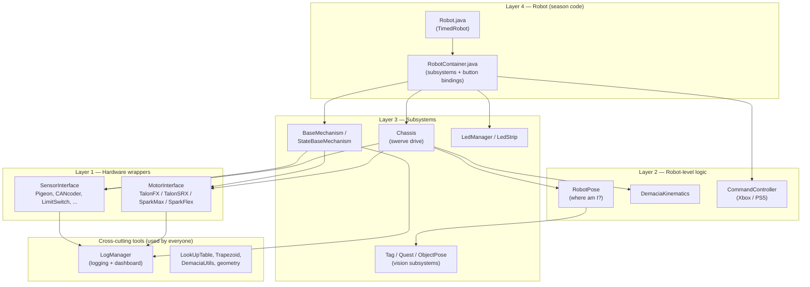

**Rule of thumb:** a lower layer should **never** know about a higher layer.
A motor should not know there is a chassis. The current code breaks this rule in a few places
(see [section 10](#10-known-problems-in-the-current-code)). Try to keep it in the new version.

### Folder map

```text
src/main/java/frc/
├── robot/                    ← season code (template)
│   ├── Main.java             ← entry point, starts Robot
│   ├── Robot.java            ← mode switching (auto / teleop / ...)
│   ├── RobotContainer.java   ← creates subsystems, binds buttons, isRed / isComp flags
│   └── Constants.java        ← numbers (ports, IDs, ...)
└── demacia/                  ← reusable library
    ├── utils/
    │   ├── motors/           ← MotorInterface + 4 motor wrappers + configs
    │   ├── sensors/          ← SensorInterface + ~13 sensor wrappers + configs
    │   ├── mechanisms/       ← BaseMechanism, StateBaseMechanism, ready-made commands
    │   ├── chassis/          ← Chassis, SwerveModule, DriveCommand, configs
    │   ├── controller/       ← CommandController (Xbox + PS5 in one class)
    │   ├── log/              ← LogManager, LogEntry, alerts
    │   ├── leds/             ← addressable LED strips
    │   ├── geometry/         ← "Demacia" copies of WPILib geometry classes
    │   └── LookUpTable, Trapezoid, DemaciaUtils, Data, Utils ...
    ├── kinematics/           ← swerve math (speeds ⇄ wheel states)
    ├── odometry/             ← RobotPose, DemaciaPoseEstimator, DemaciaOdometry
    ├── vision/               ← Limelight AprilTags, Quest, cameras
    ├── path/                 ← Leg / Circle geometry helpers
    └── sysID/                ← desktop app that analyses motor logs (SysId)
```

---

## 3. How the robot program runs

### 3.1 Startup

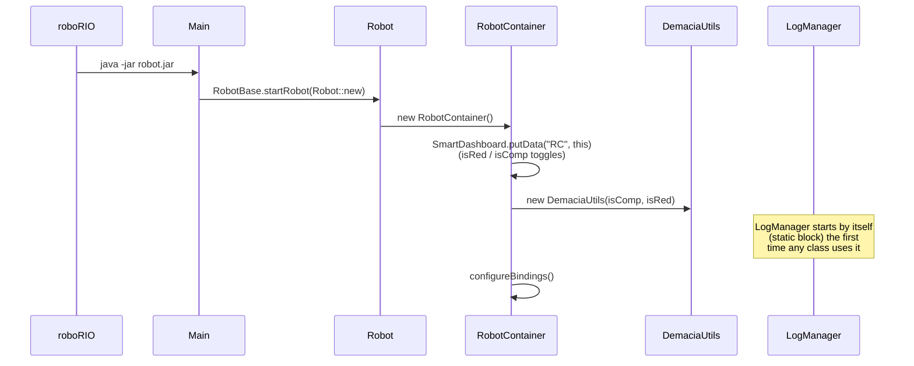

`DemaciaUtils` holds two **global flags** that the whole library reads:

- `isRed` — are we the red alliance? Used to flip driving direction.
- `isComp` — are we in a competition? When it turns `true`, `LogManager.removeInComp()`
  **removes debug log entries** to save CPU and bandwidth.

Both can be toggled from the dashboard (under `RC`).

### 3.2 The 20 ms loop

The robot code is **not** one long `main` function. WPILib calls `robotPeriodic()` **every 20 ms**
(50 times a second). Inside, `CommandScheduler.run()` does all the work:

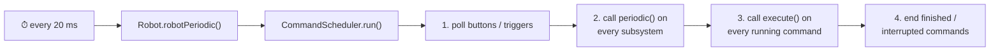

Every `SubsystemBase` gets its `periodic()` called each loop. In this library these are:
`Chassis`, every `BaseMechanism`, `LogManager`, `LedManager`, `LedStrip`, `Tag`, `Quest`, `ObjectPose`.

> ⚠️ **Never use `Thread.sleep()` or long loops** in `periodic()` or `execute()`. If one loop takes
> more than 20 ms, the whole robot lags ("loop overrun").

### 3.3 Robot modes

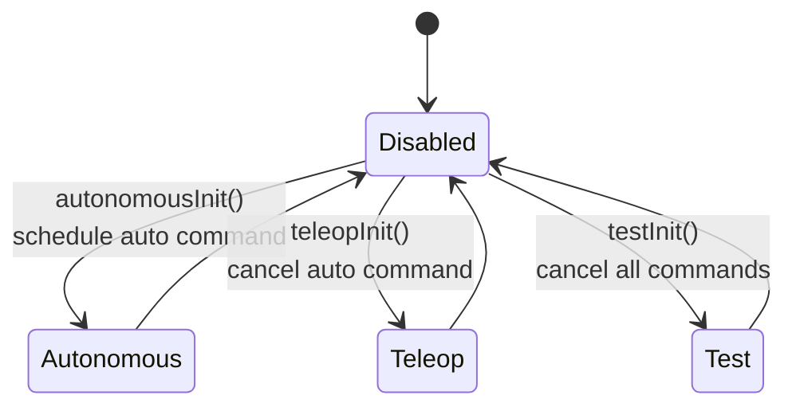

### 3.4 Commands and subsystems in one minute

- A **Subsystem** is a piece of hardware the robot owns: the chassis, an arm, an intake.
- A **Command** is an action that uses subsystems: "drive with joystick", "raise arm to 90°".
- A command **requires** its subsystems. If two commands need the same subsystem, the new one
  **interrupts** the old one. This is how you avoid two pieces of code fighting over one motor.
- A **default command** runs on a subsystem whenever nothing else uses it
  (for example, `DriveCommand` on the chassis).

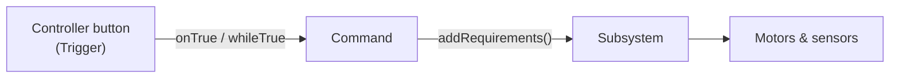

---

## 4. Hardware layer: motors and sensors

This is the most used part of the library. The goal: **the same code works with any motor brand**.

### 4.1 The pattern: Config → Device → Interface

Every device has two classes:

1. A **Config** class that holds settings (CAN ID, gear ratio, PID, current limit...).
   It uses the **builder pattern**: each `withXxx()` method returns `this`, so calls can be chained.
2. A **device** class that **extends the vendor class** (for example `TalonFX`) and
   **implements a Demacia interface** (`MotorInterface`).

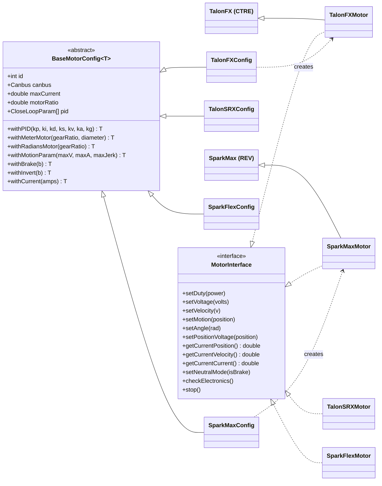

The `<T extends BaseMotorConfig<T>>` generic trick means `withPID(...)` on a `TalonFXConfig` returns
a `TalonFXConfig` (not a `BaseMotorConfig`), so chaining keeps the right type.

**Example:**

```java
TalonFXConfig armConfig = new TalonFXConfig(12, Canbus.Rio, "Arm Motor")   // CAN ID 12 on the roboRIO bus
        .withRadiansMotor(50.0)                                         // 50:1 gearbox → units are radians
        .withPID(8, 0, 0.1, 0.2, 0, 0, 0.35)                            // kP kI kD kS kV kA kG
        .withMotionParam(4, 8, 40)                                      // max vel, accel, jerk
        .withCurrent(40)
        .withBrake(true);

MotorInterface arm = new TalonFXMotor(armConfig);
arm.setAngle(Math.toRadians(90));   // Motion Magic to 90°
```

Because everything else uses `MotorInterface`, switching from TalonFX to SparkMax means changing
**only the config line**.

**What a motor wrapper does for you automatically:**

- Applies current limits, ramp rate, brake/coast and inversion
- Converts units: with `withMeterMotor` / `withRadiansMotor` you work in **meters / radians**, not rotations
- Registers itself in **`LogManager`** (position, velocity, current, voltage ...)
- Adds PID tuning fields to the dashboard (`initSendable`)
- Optional **stall detection** (high current + low velocity for X seconds → callback)

**Control modes** (`MotorInterface.ControlMode`):

| Mode | Method | Use it for |
|------|--------|------------|
| `DUTYCYCLE` | `setDuty(-1..1)` | simple open-loop power (testing, rollers) |
| `VOLTAGE` | `setVoltage(v)` | open-loop, but independent of battery voltage |
| `VELOCITY` | `setVelocity(v)` | shooters, drive wheels |
| `POSITION_VOLTAGE` | `setPositionVoltage(p)` | position with plain PID |
| `MOTION` | `setMotion(p)` | position with a smooth motion profile (Motion Magic) |
| `ANGLE` | `setAngle(rad)` | like `MOTION`, but for rotating joints |

### 4.2 Sensors

Sensors follow exactly the same pattern:

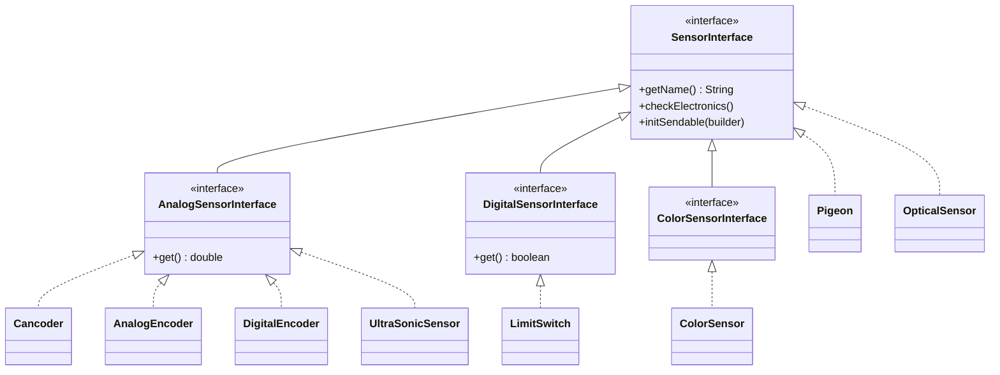

Each one has a matching `XxxConfig extends BaseSensorConfig<XxxConfig>`.
`Pneumatics` and `ServoMotor` also live here and have configs, but they do not implement `SensorInterface`.

---

## 5. Mechanisms: building a subsystem in a few lines

Most robot parts (arm, elevator, intake, shooter) are just "some motors + some sensors".
Instead of writing the same subsystem every season, the library gives you two base classes.

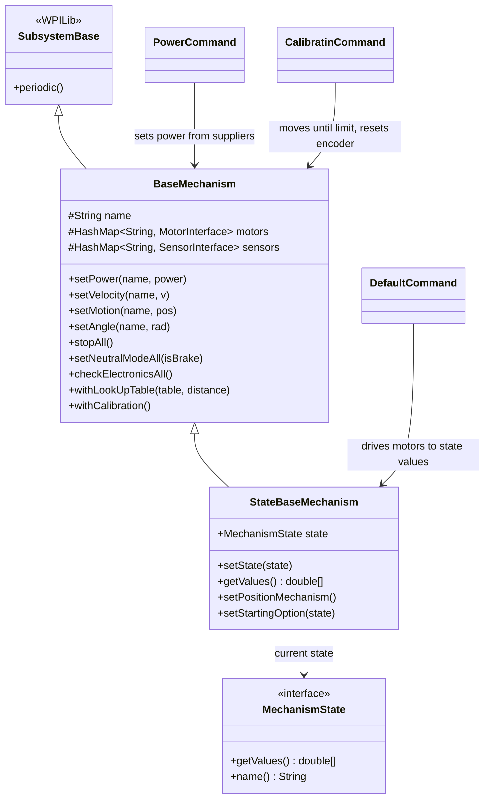

### 5.1 `BaseMechanism`

- Stores motors and sensors **by name**, so you can say `setPower("Intake Roller", 0.5)`.
- Puts **Brake / Coast** buttons on the dashboard for every motor (works while disabled).
- Helpers: `stopAll()`, `checkElectronicsAll()`, look-up table support, calibration flag.

### 5.2 `StateBaseMechanism` — a state machine

You describe the mechanism as a list of **states**. Each state is an array of **target values**,
one value per motor:

```java
public enum ArmState implements MechanismState {
    HOME     (new double[] { 0.0 }),
    INTAKE   (new double[] { Math.toRadians(-10) }),
    SCORE_L2 (new double[] { Math.toRadians(80) });

    private final double[] values;
    ArmState(double[] values) { this.values = values; }
    public double[] getValues() { return values; }
}

StateBaseMechanism arm = new StateBaseMechanism(
        "Arm", new MotorInterface[] { armMotor }, new SensorInterface[] { limitSwitch }, ArmState.class);
arm.setPositionMechanism();   // in IDLE, hold the current position instead of going to 0
arm.setDefaultCommand(new DefaultCommand(arm, new ControlMode[] { ControlMode.ANGLE }));

// in RobotContainer:
controller.upButton().onTrue(new InstantCommand(() -> arm.setState(ArmState.SCORE_L2)));
```

`DefaultCommand` runs forever. Every 20 ms it reads `arm.getValues()` and sends each value to its
motor using the control mode you chose for that motor.

The library also adds **built-in states** for you:

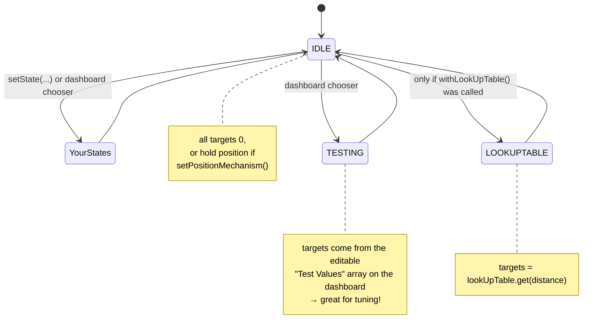

The **State Chooser** on the dashboard lets you switch states by hand while testing,
without writing any code.

---

## 6. The swerve chassis

The robot uses a **swerve drive**: 4 modules, each with a **drive** motor (wheel speed),
a **steer** motor (wheel direction) and a **CANcoder** (absolute wheel angle).
A **Pigeon2** gyro gives the robot heading.

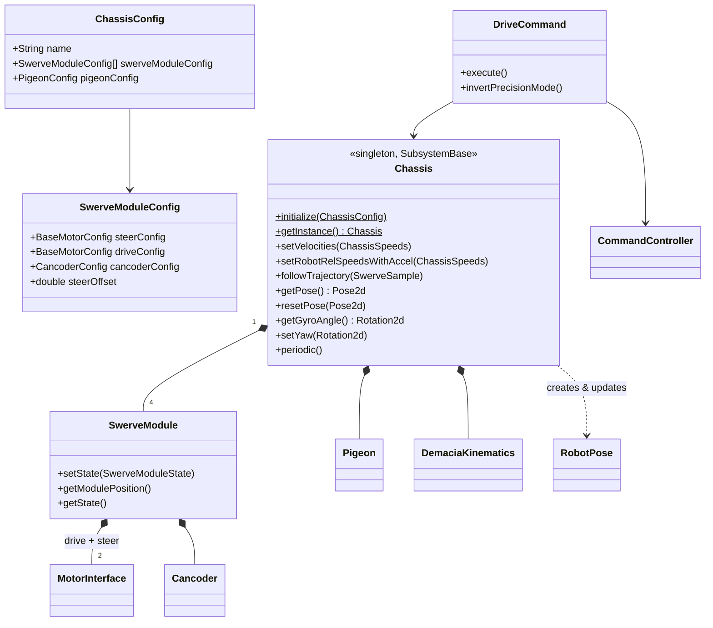

### 6.1 From joystick to wheels

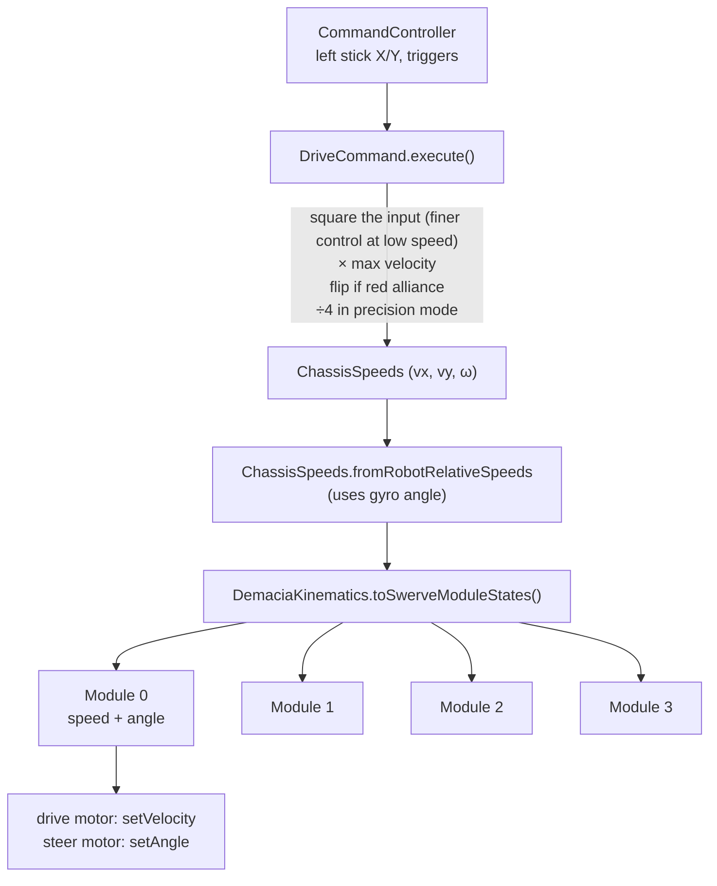

**Autonomous:** `Chassis.followTrajectory(SwerveSample)` receives one sample from a **Choreo**
path. It adds small PID corrections in x, y and heading to the path's planned speeds, then calls
`setVelocities`.

> `Chassis` is a **singleton**. You create it once with `Chassis.initialize(config)` and get it
> everywhere with `Chassis.getInstance()`.

---

## 7. Where is the robot? — pose estimation and vision

"Pose" = where the robot is on the field (x, y in meters) + which way it faces (angle).
We combine **three sources**, because each one alone has problems:

| Source | Good at | Bad at |
|--------|---------|--------|
| **Odometry** (wheel encoders + gyro) | smooth, fast, always available | drifts over time, wrong when wheels slip |
| **AprilTags** (Limelight cameras) | exact position on the field | only when a tag is visible, noisy when far or moving fast |
| **Quest** (Meta Quest headset, QuestNav) | smooth and absolute | must be given a starting pose, can disconnect |

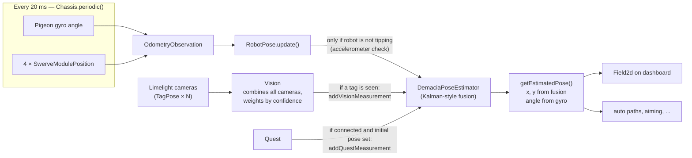

**Standard deviations (STD):** every measurement comes with an STD, which tells the estimator how
much to trust it. A small STD means "trust me a lot". Vision confidence goes down when the tag is
far (`BEST_RELIABLE_DISTANCE` = 1 m → `WORST_RELIABLE_DISTANCE` = 4 m) and when the robot moves
fast (1 m/s → 3 m/s). These numbers live in `VisionConstants`.

**Latency compensation:** a camera picture is about 50 ms old when it arrives. `DemaciaPoseEstimator`
keeps a short history of odometry poses (`sampleAt(timestamp)`), so it can apply the vision
correction **at the moment the picture was taken** and then replay the odometry from there.

---

## 8. Logging and telemetry

`LogManager` is a subsystem that starts automatically. It sends values to two places:

- **a log file on the roboRIO** (WPILib `DataLog`) — open it after a match with AdvantageScope
- **NetworkTables** — live values on the dashboard (Elastic, with the
  [Demacia widgets](https://github.com/Demacia5635/Elastic_Dashboard-Demacia_Widgets))

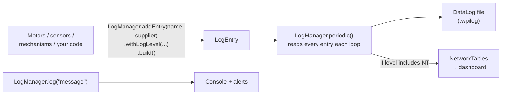

```java
LogManager.addEntry("Arm/angle", () -> arm.getCurrentAngle())
        .withLogLevel(LogLevel.LOG_AND_NT)
        .build();

LogManager.log("Arm calibrated");
```

| `LogLevel` | Written to file | Shown on dashboard | Kept in competition |
|------------|:---:|:---:|:---:|
| `LOG_ONLY_NOT_IN_COMP` (default) | ✅ | ❌ | ❌ |
| `LOG_ONLY` | ✅ | ❌ | ✅ |
| `LOG_AND_NT_NOT_IN_COMP` | ✅ | ✅ | ❌ (NT part removed) |
| `LOG_AND_NT` | ✅ | ✅ | ✅ |

`LogManager.log(...)` is the most called function in the whole library (48 callers), and every motor
and sensor registers itself through `addEntry`. Logging is the backbone of debugging. **Keep it in
the new version.**

**SysId:** `sysID/SysidApp` is a desktop app (it runs on a laptop, not the robot). It reads the
motor logs and computes feed-forward constants (kS, kV, kA, kG) for you.

---

## 9. Other utilities

| Class | What it does | Example use |
|-------|--------------|-------------|
| `CommandController` | One class for **Xbox and PS5**. Same button names (`upButton()`, `leftBumper()`...) on both | driver / operator controllers |
| `LookUpTable` | Stores rows like `{distance, rpm, angle}` and **linearly interpolates** between them | shooter: distance → speed + hood angle |
| `Trapezoid` | Computes the next velocity for a trapezoid motion profile (accelerate → cruise → decelerate) | smooth custom movements |
| `LedManager` + `LedStrip` | One addressable LED buffer split into named strips. Each strip can be a solid color, blink, or rainbow | showing robot state to the drivers |
| `DemaciaUtils` | Global `isRed` / `isComp` flags | — |
| `geometry/*Demacia` | Copies of WPILib's `Pose2d`, `Translation2d`, etc. with extra helpers | — |
| `path/Leg`, `path/Circle` | Geometry for the tangent line between two circles (path planning around obstacles) | — |
| `vision/utils/LimelightHelpers` | The official Limelight helper file (1,600 lines, not ours) | — |

---

## 10. Known problems in the current code

This is **not** blame. Every season's code collects shortcuts. But you should know about these
before you build on top of them. They were found by reading the code and by analysing its call
graph with `codebase-memory-mcp`.

### 10.1 Layer violations (lower layers know about higher layers)

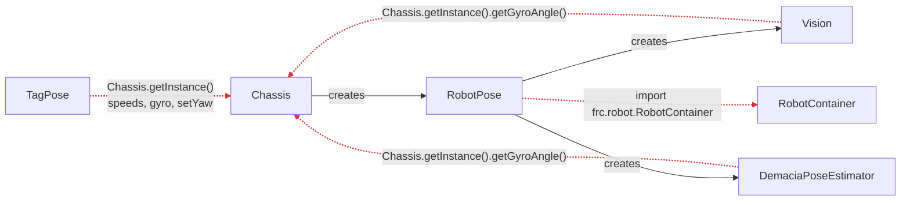

The red arrows are **circular dependencies**. Vision and the pose estimator reach back into the
chassis singleton to read the gyro. As a result:

- you **cannot test** vision or odometry without a real chassis,
- the order of creation matters (if `Chassis` is not ready yet → `NullPointerException`),
- the "library" depends on `frc.robot`, so it is not really reusable.

### 10.2 Bugs and unfinished work

| Where | Problem |
|-------|---------|
| `Chassis` constructor | `modulePositions` is created but never filled (the line that fills it is commented out). `SwerveModuleConfig.position` is a single `double`, not a `Translation2d`. **The kinematics get an array of `null`s.** |
| `Chassis` javadoc | Mentions `setVelocitiesWithAccel`, which does not exist. `setRobotRelSpeedsWithAccel` does **not** limit acceleration. It only converts to field-relative. |
| `Chassis.periodic()` | `updateCommon()` is commented out with `//TODO: RETORN IT`. |
| `VisionConstants.TAGS_ARRAY` | Empty (all cameras are commented out), so vision never sees a tag. |
| `VisionConstants` | Comments say "2026 REEFSCAPE", but the tag names (Hub, Outpost, Depot) and positions are season-specific data inside the library. |
| `RobotPose.update()` | Quest disconnect is only printed to the log (`TODO: change to led signal`). |
| `atouApdate.yaml` | Not in `.github/workflows/`, so the sync never runs. |

### 10.3 Code smells (makes the code harder to learn)

- **Duplicates:** two `LogReader` classes (`utils/log` and `sysID`), two `ObjectPose` classes
  (`vision` and `vision/subsystem`), and both `Utils` and `Utilities`.
- **Typos and unclear names:** `CalibratinCommand`, `atouApdate`, `GetDistFromCamera` (Java methods start with a lowercase letter), and `setGay` (it draws a rainbow, so call it `setRainbow`).
- **Many singletons** (`Chassis`, `RobotPose`, `LogManager`) mean hidden global state.
- **Season-specific code in the library** (`isRotateToHub`, hub tags, commented turret code).
- **Big commented-out blocks**. Git remembers old code, so you can delete it.

---

## 11. Recommendations for the new version

**Keep** what works well:

- ✅ `MotorInterface` / `SensorInterface` + builder configs. Brand-independent hardware is great.
- ✅ `StateBaseMechanism` + dashboard state chooser + TESTING state. Very fast to tune.
- ✅ `LogManager` with log levels and competition mode.
- ✅ `CommandController` (Xbox + PS5 in one class).
- ✅ Fusing odometry, AprilTags and Quest with latency compensation.

**Change:**

1. **Strict layers.** Code may only depend downward. Pass data in instead of reaching up:
   ```java
   // ❌ now: inside Vision
   new Pose2d(x, y, Chassis.getInstance().getGyroAngle());

   // ✅ better: whoever owns the gyro gives it to vision
   public Pose2d getPoseEstimation(Rotation2d gyroAngle) { ... }
   // or in the constructor: new Vision(cameras, chassis::getGyroAngle)
   ```
2. **Split "library" and "season".** Anything with a game-piece or field-element name
   (hub, turret, reef...) goes to `frc/robot`. The library should compile without `frc/robot`.
3. **Fewer singletons.** Create objects in `RobotContainer` and pass them through constructors
   (*dependency injection*). Then you can create two of them in a unit test.
4. **Hardware abstraction for simulation.** Since all motors already go through `MotorInterface`,
   add a `SimMotor implements MotorInterface`. Then the whole robot can run in the WPILib simulator
   without a robot (consider the **AdvantageKit "IO layer"** pattern).
5. **Unit tests.** `LookUpTable`, `Trapezoid`, `DemaciaKinematics`, `Leg` and the pose estimator
   are pure math, so they are easy to test with JUnit (`src/test/java`).
6. **Fix the table in 10.2** before relying on the chassis.
7. **Clean up names and duplicates.** One `LogReader`, one `ObjectPose`, one utils class, no typos.

### Suggested target structure

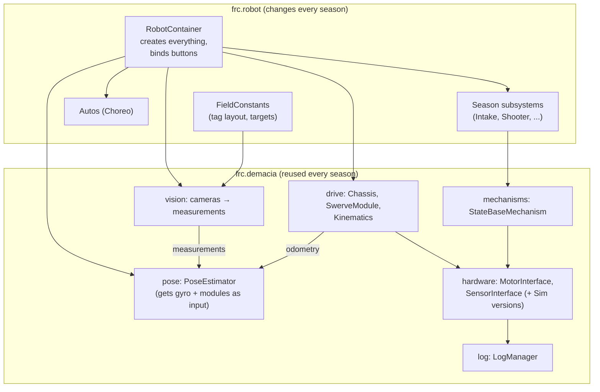

Notice that every arrow points **down or sideways**, and nothing in `lib` points back to `season`.

---

## 12. Glossary

| Word | Meaning |
|------|---------|
| **roboRIO** | The computer on the robot that runs this code |
| **CAN bus** | The wire network that connects motor controllers and sensors. Each device has a **CAN ID** |
| **Subsystem** | A robot part that owns hardware (chassis, arm...) |
| **Command** | An action that uses subsystems for some time |
| **Trigger** | A condition (usually a button) that starts or stops a command |
| **Duty cycle** | Motor power from -1 (full reverse) to 1 (full forward) |
| **PID** | A controller that corrects error: P = proportional, I = integral, D = derivative |
| **Feed-forward (kS, kV, kA, kG)** | Predicted voltage needed (static friction, velocity, acceleration, gravity), so PID has less work |
| **Motion Magic** | CTRE's built-in motion profile: moves to a position with limited velocity and acceleration |
| **Swerve** | A drivetrain where each wheel can point in any direction |
| **Odometry** | Estimating position from wheel encoders + gyro |
| **Pose** | Position (x, y) + heading (angle) on the field |
| **AprilTag** | A black-and-white square marker on the field. A camera can compute the robot's position from it |
| **STD (standard deviation)** | How noisy a measurement is. Smaller = more trusted |
| **NetworkTables (NT)** | How the robot and the dashboard share live values |
| **Singleton** | A class with exactly one instance, reached via `getInstance()` |
| **Builder pattern** | `new Config(...).withA().withB()` — chained setters that return `this` |
