# Robot Software Architecture — Demacia 5635 (`log` branch)

> **Who this is for:** team members who are about to write the **next version** of the robot code.
> You should know basic Java (classes, interfaces, `extends` / `implements`). You do **not** need to
> know WPILib in depth — the important ideas are explained below.
>
> **How to read it:** sections 1–3 give the big picture. Sections 4–10 go deep into each part.
> Section 11 lists what is broken or awkward today, and section 12 suggests how to do it better
> in the new version.

---

## Table of contents

1. [What is in this repository?](#1-what-is-in-this-repository)
2. [The big picture — layers](#2-the-big-picture--layers)
3. [How the robot program runs](#3-how-the-robot-program-runs)
4. [Hardware layer: motors and sensors](#4-hardware-layer-motors-and-sensors)
5. [Mechanisms: building a subsystem in a few lines](#5-mechanisms-building-a-subsystem-in-a-few-lines)
6. [The swerve chassis](#6-the-swerve-chassis)
7. [Where is the robot? — pose estimation and vision](#7-where-is-the-robot--pose-estimation-and-vision)
8. [Logging and telemetry](#8-logging-and-telemetry)
9. [Tools built on the log: SysId, replay, Elastic](#9-tools-built-on-the-log-sysid-replay-elastic)
10. [Other utilities](#10-other-utilities)
11. [Known problems in the current code](#11-known-problems-in-the-current-code)
12. [Recommendations for the new version](#12-recommendations-for-the-new-version)
13. [Glossary](#13-glossary)

---

## 1. What is in this repository?

| Part | Folder | What it is |
|------|--------|------------|
| **Season code** | `src/main/java/frc/robot/` | `Robot`, `RobotContainer`, `Constants`, chassis constants for two physical robots (`chassis/RobotBChassisConstants`, `chassis/RobotCChassisConstants`) and camera configs (`vision/VisionConstants`). |
| **Demacia library** | `src/main/java/frc/demacia/` | ~110 Java files of **reusable** code: motors, sensors, mechanisms, swerve, pose estimation + vision, logging, Elastic dashboard generator, SysId, log replay, LEDs, controllers. |

The idea: every season you write only the season-specific parts. The library gives you motors, a
drivetrain, position tracking, logging, tuning tools and a ready dashboard for free.

**Tech stack**

- Java 17, built with **Gradle** + **GradleRIO 2026** (`build.gradle`)
- **WPILib** command-based framework
- Vendor libraries (`vendordeps/`):
  - **Phoenix 6 / Phoenix 5** — CTRE devices (TalonFX, TalonSRX, CANcoder, Pigeon2)
  - **REVLib** — REV devices (SparkMax, SparkFlex)
  - **ChoreoLib** — following paths made in the Choreo app
  - **QuestNavLib** — position tracking from a Meta Quest headset
  - **WPILibNewCommands** — the command-based framework

> **Library sync:** `atouApdate.yaml` is a GitHub Actions workflow that copies `frc/demacia` from the
> central repo `Demacia5635/2026UpdateRobotCodeEmpty`. ⚠️ It sits in the repo root, not in
> `.github/workflows/`, so GitHub **does not run it** right now.

---

## 2. The big picture — layers

Think of the code as a stack. Each layer uses the layer **below** it:

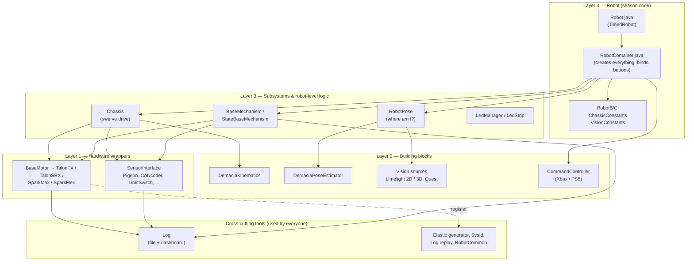

**Rule of thumb:** a lower layer should **never** know about a higher layer. On this branch the
pose estimator no longer reaches into the chassis. It receives odometry through a `Supplier`, which
is exactly the right pattern. A few leftovers are listed in [section 11](#11-known-problems-in-the-current-code).

### Folder map

```text
src/main/java/frc/
├── robot/                         ← season code
│   ├── Robot.java                 ← runs the scheduler + RobotPose every 20 ms
│   ├── RobotContainer.java        ← creates Chassis, DriveCommand, RobotPose; binds buttons
│   ├── chassis/RobotB…, RobotC…   ← one ChassisConfig per physical robot
│   └── vision/VisionConstants     ← camera / Quest configs
└── demacia/                       ← reusable library
    ├── utils/
    │   ├── motors/                ← MotorInterface, BaseMotor (shared logic), 4 vendor motors + configs
    │   ├── sensors/               ← SensorInterface + ~13 sensor wrappers + configs
    │   ├── mechanisms/            ← BaseMechanism, StateBaseMechanism, ready-made commands
    │   ├── chassis/               ← Chassis, SwerveModule, DriveCommand, configs, Mk5nConstants
    │   ├── log/                   ← Log, LogEntry, DashboardBuilder, LogReader, LogReplay
    │   ├── elastic/               ← ElasticGenerator (auto dashboard), ElasticNotification
    │   ├── sysid/                 ← SysidCommand (on-robot feed-forward fitting)
    │   ├── controller/            ← CommandController (Xbox + PS5 in one class)
    │   ├── leds/                  ← addressable LED strips
    │   ├── geometry/              ← "Demacia" copies of WPILib geometry (mutable!)
    │   └── Data, RobotCommon, LookUpTable, Trapezoid, Utils ...
    ├── kinematics/                ← swerve math (speeds ⇄ wheel states)
    ├── RobotPose/
    │   ├── RobotPose.java         ← fuses odometry + vision, singleton
    │   ├── Estimation/            ← DemaciaPoseEstimator, DemaciaOdometry
    │   └── Vision/                ← VisionSource interface, Limelight 2D/3D, Quest, configs
    ├── path/                      ← Leg / Circle geometry helpers (unused yet)
    └── sysID/                     ← Sysid math + desktop SysidApp (package name: frc.demacia.sysid)
```

---

## 3. How the robot program runs

### 3.1 Startup

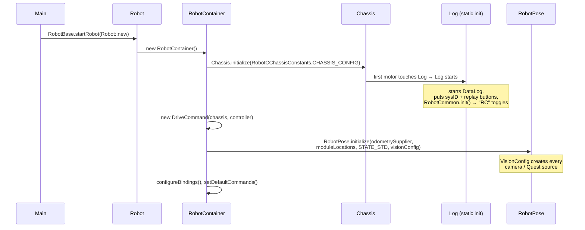

`RobotCommon` holds two **global flags** that the library reads:

- `isRed` — are we the red alliance? `DriveCommand` uses it to flip the driving direction. **Defaults to `true`.**
- `isComp` — are we in a competition? Meant to drop debug log entries (see [section 11](#11-known-problems-in-the-current-code)).

Both are toggled on the dashboard under `RC`.

### 3.2 The 20 ms loop

The robot code is **not** one long `main` function. WPILib calls `robotPeriodic()` **every 20 ms**
(50 times a second):

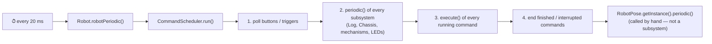

> ⚠️ **Never use `Thread.sleep()` or long loops** in `periodic()` or `execute()`. If one loop takes
> more than 20 ms, the whole robot lags ("loop overrun").

### 3.3 Robot modes

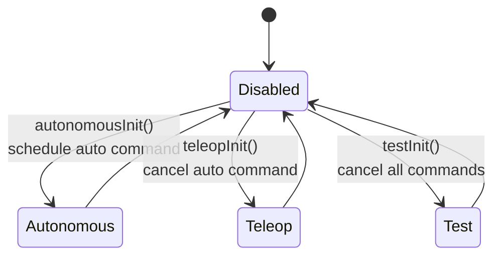

`DriveCommand` does nothing while the robot is in autonomous, so autos must drive the chassis themselves.

### 3.4 Commands and subsystems in one minute

- A **Subsystem** is a piece of hardware the robot owns: the chassis, an arm, an intake.
- A **Command** is an action that uses subsystems: "drive with joystick", "raise arm to 90°".
- A command **requires** its subsystems. If two commands need the same subsystem, the new one
  **interrupts** the old one. This is how you avoid two pieces of code fighting over one motor.
- A **default command** runs on a subsystem whenever nothing else uses it
  (for example, `DriveCommand` on the chassis).

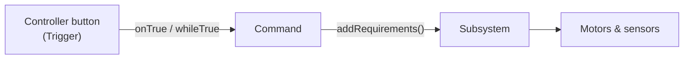

---

## 4. Hardware layer: motors and sensors

The goal: **the same code works with any motor brand**, and every motor comes with logging,
tuning and SysId for free.

### 4.1 Motors: Config → BaseMotor → vendor motor

On this branch all shared motor logic lives in one abstract class, `BaseMotor`. Each vendor class
only "fills in the blanks" (how to configure that brand, how to send a command to it). This is the
**template method** pattern.

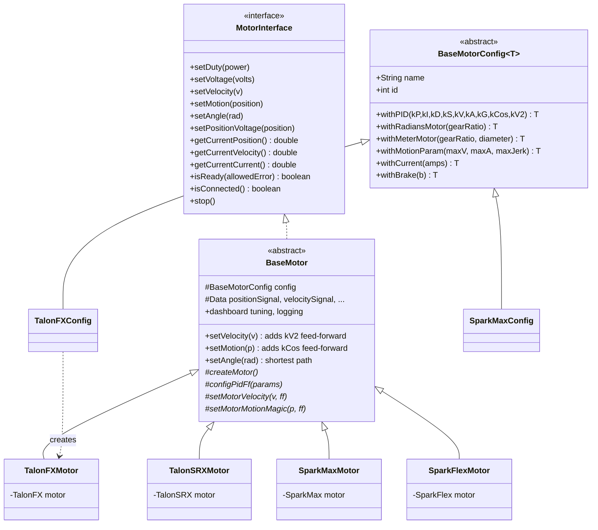

The `<T extends BaseMotorConfig<T>>` generic trick means `withPID(...)` on a `TalonFXConfig` returns
a `TalonFXConfig` (not a `BaseMotorConfig`), so chaining keeps the right type.

**Example:**

```java
TalonFXConfig armConfig = new TalonFXConfig("Arm Motor", 12, Canbus.Rio)  // name first!
        .withRadiansMotor(50.0)                              // 50:1 gearbox → units are radians
        .withPID(8, 0, 0.1, 0.2, 0, 0, 0, 0.35, 0)           // kP kI kD kS kV kA kG kCos kV2
        .withMotionParam(4, 8, 40)                           // max vel, accel, jerk
        .withCurrent(40)
        .withBrake(true);

MotorInterface arm = new TalonFXMotor(armConfig);
arm.setAngle(Math.toRadians(90));   // Motion Magic to 90°, shortest way round
```

**What every motor gives you automatically:**

- Current limits, ramp rate, brake/coast, inversion, unit conversion (meters / radians)
- Logging of position, velocity, acceleration, voltage, current, set-point and error
- On the dashboard under `motors/<name>`: live PID/FF tuning, Motion Magic tuning, and a
  **test value command** with a control-mode chooser, so you can spin a motor by hand
- Registration with the **Elastic layout generator** and **SysId** (section 9)

**Control modes** (`MotorInterface.ControlMode`):

| Mode | Method | Use it for |
|------|--------|------------|
| `DUTYCYCLE` | `setDuty(-1..1)` | simple open-loop power (testing, rollers) |
| `VOLTAGE` | `setVoltage(v)` | open-loop, but independent of battery voltage |
| `VELOCITY` | `setVelocity(v)` | shooters, drive wheels |
| `POSITION_VOLTAGE` | `setPositionVoltage(p)` | position with plain PID |
| `MAGIC_MOTION` | `setMotion(p)` | position with a smooth motion profile |
| `ANGLE` | `setAngle(rad)` | like `MAGIC_MOTION`, for rotating joints (radians motors only) |

### 4.2 Sensors

Sensors follow the same config pattern (name first):

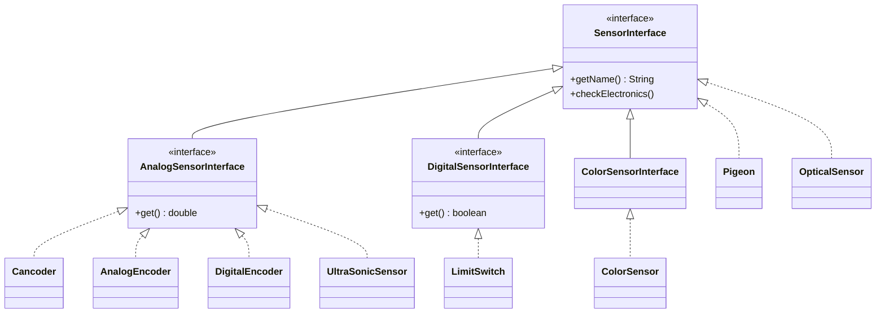

Each sensor logs itself, shows up under `sensors/<name>` and registers with Elastic.
`Pneumatics` and `ServoMotor` have configs too, but they do not implement `SensorInterface`.

---

## 5. Mechanisms: building a subsystem in a few lines

Most robot parts (arm, elevator, intake, shooter) are just "some motors + some sensors".
The library gives you two base classes so you don't rewrite the same subsystem every season.

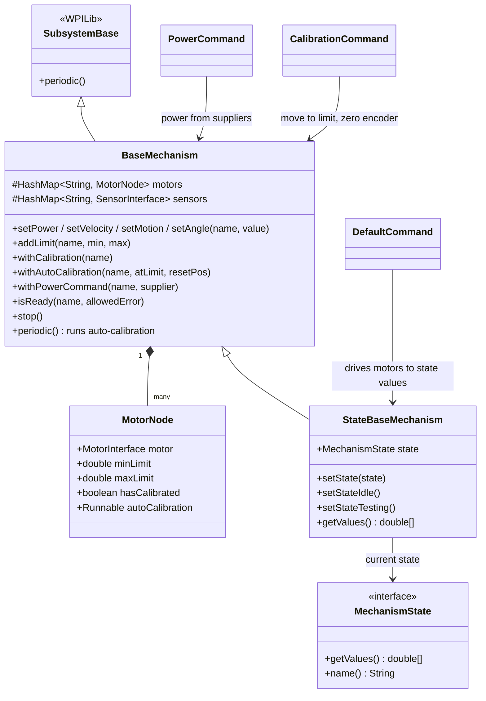

### 5.1 `BaseMechanism` — motors with limits and calibration

Each motor is wrapped in a `MotorNode` that remembers its **soft limits** and whether it is
**calibrated** (its encoder knows where zero is).

- `addLimit("Arm Motor", min, max)`: every position target is clamped into `[min, max]`, so a
  bug can't drive the arm through the floor.
- `withAutoCalibration("Arm Motor", limitSwitch::get, resetPos)`: until the limit switch is pressed
  once, **position commands are ignored**. When it is pressed, the encoder is set to `resetPos`.
  Power and velocity commands still work, so you can drive the arm down to the switch.
- Dashboard: brake/coast buttons, a manual "reset" button, and optional manual power control.

### 5.2 `StateBaseMechanism` — a state machine

You describe the mechanism as a list of **states**. Each state is an array of **target values**,
one per motor:

```java
public enum ArmState implements MechanismState {
    HOME(0.0),
    INTAKE(Math.toRadians(-10)),
    SCORE(Math.toRadians(80));

    private final double[] values;
    ArmState(double... values) { this.values = values; }
    public double[] getValues() { return values; }
}

StateBaseMechanism arm = new StateBaseMechanism(
        "Arm", new MotorInterface[] { armMotor }, new SensorInterface[] { limitSwitch }, ArmState.class);
arm.addLimit("Arm Motor", Math.toRadians(-20), Math.toRadians(100));
arm.withAutoCalibration("Arm Motor", limitSwitch::get, Math.toRadians(-20));
arm.setDefaultCommand(new DefaultCommand(arm, new ControlMode[] { ControlMode.ANGLE }));

// in RobotContainer:
controller.upButton().onTrue(new InstantCommand(() -> arm.setState(ArmState.SCORE)));
```

`DefaultCommand` runs forever. Every 20 ms it reads the current state and sends each value to its
motor using the chosen control mode. In `IDLE`, it **stops** the motors.

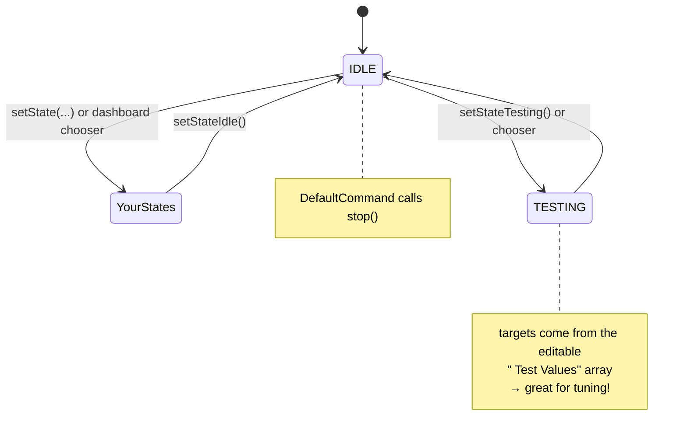

---

## 6. The swerve chassis

The robot uses a **swerve drive**: 4 modules, each with a **drive** motor (wheel speed), a **steer**
motor (wheel direction) and a **CANcoder** (absolute wheel angle). A **Pigeon2** gyro gives the
robot heading.

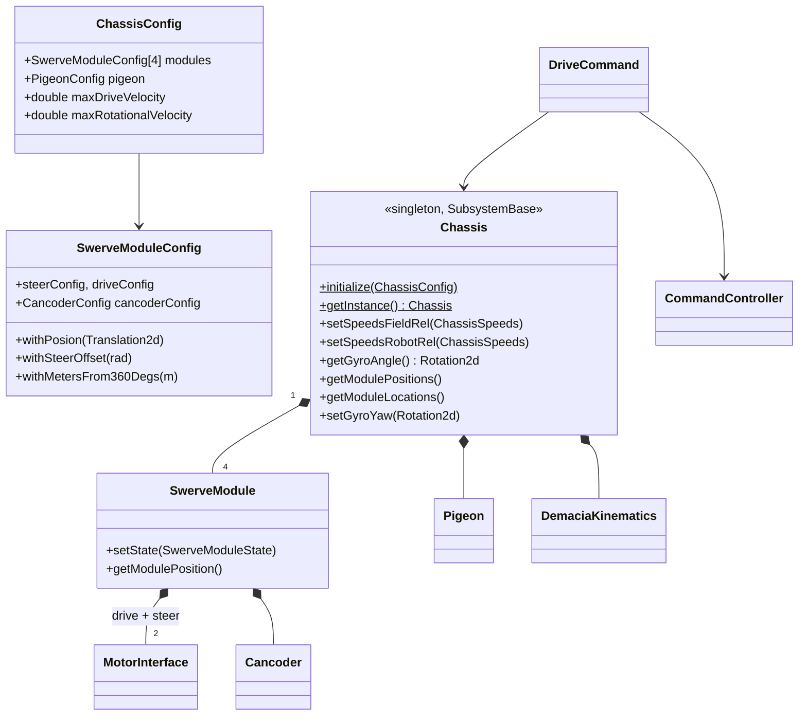

Each physical robot has its own constants class in `frc/robot/chassis` (CAN IDs, gear ratios from
`Mk5nConstants`, PID, module positions FL/FR/BL/BR, steer offsets). `RobotContainer` picks one.

### 6.1 From joystick to wheels

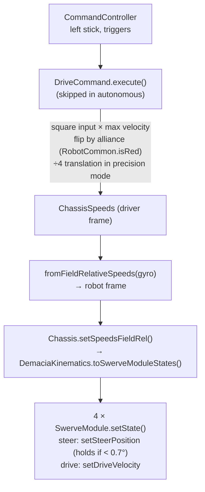

> ⚠️ Despite its name, `setSpeedsFieldRel` expects **robot-relative** speeds (see section 11).

---

## 7. Where is the robot? — pose estimation and vision

"Pose" = where the robot is on the field (x, y in meters) + which way it faces (angle).
We combine several sources, because each one alone has problems:

| Source | Good at | Bad at |
|--------|---------|--------|
| **Odometry** (wheels + gyro) | smooth, fast, always available | drifts over time, wrong when wheels slip |
| **Limelight 2D** (angles to one AprilTag) | simple, works with one tag | only x/y, needs exact camera height/pitch |
| **Limelight 3D / MegaTag2** | exact position from every visible tag | only when tags are visible |
| **Quest** (QuestNav headset) | smooth and absolute | must be anchored to a known pose, can drift or disconnect |

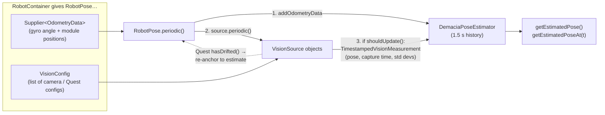

**Key ideas:**

- **Capture time, not arrival time.** A camera frame is a few tens of ms old when it arrives. The
  estimator keeps 1.5 s of odometry history, inserts the measurement **at the moment the picture
  was taken**, and replays the history from there.
- **Standard deviations (STD)** tell the estimator how much to trust something. Small = trust it a
  lot. All vision sources send **∞ for the heading**, so the angle always comes from the gyro and
  vision only corrects x/y.
- **Adding a camera** is configuration only: add a `LimelightTagCamera2dConfig` /
  `LimelightTagCamera3dConfig` / `QuestConfig` (name, robot→camera `Transform3d`, STD) to
  `VisionConstants.visionConfig`. The Limelight's hostname must be `limelight-<name>`.
- Tag positions come from WPILib's official field layout (`AprilTagFieldLayout`), not from our code.

---

## 8. Logging and telemetry

`Log` (formerly `LogManager`) is a subsystem that starts automatically. It sends values to two places:

- **a log file on the roboRIO** (WPILib `DataLog`): open it after a match with AdvantageScope
- **NetworkTables**: live values on the dashboard (Elastic, with the
  [Demacia widgets](https://github.com/Demacia5635/Elastic_Dashboard-Demacia_Widgets))

```java
Log.log("Arm calibrated");                                          // a message + dashboard alert
Log.putData("Arm/angle", () -> arm.getMotor(0).getCurrentAngle());  // value: file + live (LOG_AND_NT)
Log.putData("Arm/debug", new Supplier[] { () -> x },
        LogLevel.LOG_ONLY, "", true);                               // file only, own entry
```

| `LogLevel` | Written to file | Shown on dashboard | Meant for |
|------------|:---:|:---:|---|
| `LOG_ONLY_NOT_IN_COMP` | ✅ | ❌ | debugging, dropped in competition |
| `LOG_ONLY` | ✅ | ❌ | always in the file |
| `LOG_AND_NT_NOT_IN_COMP` | ✅ | ✅ | live while testing |
| `LOG_AND_NT` | ✅ | ✅ | live in matches (default of the short `putData`) |

### 8.1 How values flow

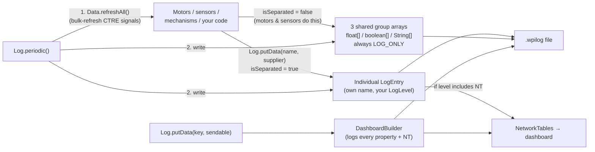

- **Grouping** saves CPU: hundreds of motor values are written as three big arrays per loop. The
  array's name is all the member names joined with `" | "`, and `LogReader` splits them back.
- **Cached values:** `Data.refreshAll()` runs at the start of `Log.periodic()`. Every motor and
  sensor getter returns the value cached there, which keeps CAN traffic low.

---

## 9. Tools built on the log: SysId, replay, Elastic

Because every motor logs the same way, the library can build tools on top of the log file.

### 9.1 On-robot SysId (automatic feed-forward)

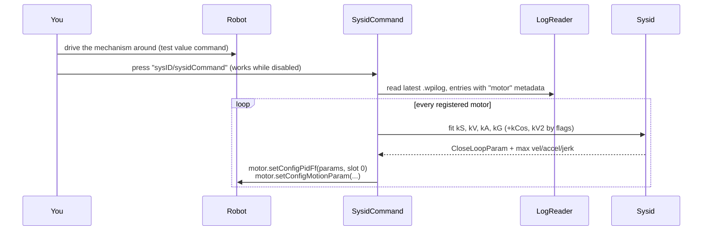

The new values are applied **live**. Copy them into the constants file to keep them.
`sysID/SysidApp` is a desktop version of the same math.

### 9.2 Log replay

`replay/LoadLatestLog` loads the latest log and republishes every entry under `replay/...`. The
`replay/time` slider lets you scrub through the match on the dashboard.

### 9.3 Elastic dashboard generator

Every motor, sensor, mechanism, vision source and the chassis registers itself with
`ElasticGenerator`. Pressing **`elastic/Generate Layout`** writes `Generated_Elastic_Layout.json`
with ready tabs (tuning, chassis, vision, SysId, one per mechanism), served from the robot on port
5800. `ElasticNotification` can pop up messages or switch tabs on the drivers' dashboard.

---

## 10. Other utilities

| Class | What it does | Example use |
|-------|--------------|-------------|
| `CommandController` | One class for **Xbox and PS5**. Same button names on both, axes already dead-banded | driver / operator controllers |
| `RobotCommon` | Global `isRed` / `isComp` flags, dashboard `RC` | alliance-dependent logic |
| `LookUpTable` | Stores rows like `{distance, rpm, angle}` and **linearly interpolates** between them | shooter: distance → speed + angle |
| `Trapezoid` | Next velocity of a trapezoid profile (accelerate → cruise → decelerate) | smooth custom motion |
| `LedManager` + `LedStrip` | One LED buffer split into named strips (solid, blink, rainbow) | showing robot state to drivers |
| `Mk5nConstants` | SDS MK5n swerve gear ratios | chassis constants |
| `geometry/*Demacia` | Mutable copies of WPILib geometry classes | — (unused) |
| `path/Leg`, `path/Circle` | Tangent line between two circles | — (unused yet) |

---

## 11. Known problems in the current code

This is **not** blame. Every season's code collects shortcuts. But you should know about these
before you build on top of them. They were found by reading the code and by analysing its call
graph with `codebase-memory-mcp`.

### 11.1 Dependencies

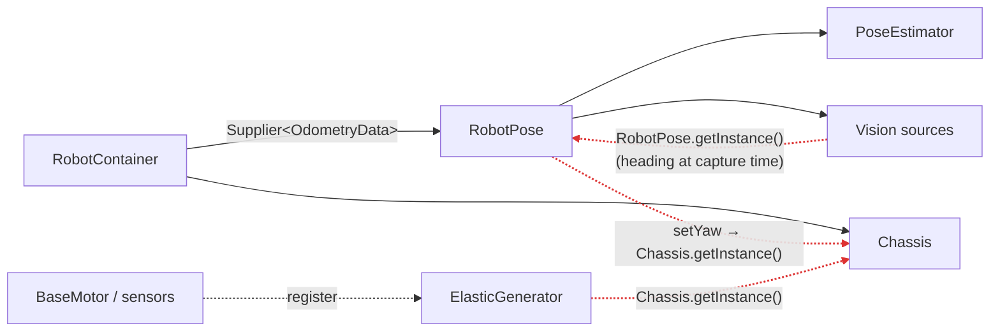

This is **much better** than before: the estimator gets odometry through a `Supplier` and never
touches the chassis. The red arrows are the leftovers. Singletons reach "up" or "sideways", which
makes creation order matter and testing harder. Everything still also relies on **static
initializers** (`Log`, `RobotCommon`) that have side effects (they start logging and put buttons on
the dashboard) the first time any class is touched.

### 11.2 Bugs and unfinished work

| Where | Problem |
|-------|---------|
| `RobotContainer` | Uses `RobotCChassisConstants`, where the pigeon ID, all PID/FF and all steer offsets are `0 // TODO`. Robot B has real values. |
| `VisionConstants` | Every camera / Quest offset is `0, 0, 0 // TODO`. |
| `Chassis.setSpeedsFieldRel` | Name says field-relative, but the kinematics ignore heading, so it needs **robot-relative** speeds. `setSpeedsRobotRelWithAccel` converts the wrong way, and it does not limit acceleration. |
| `Chassis.getChassisSpeedsRobotRel` | Passes the gyro **angle** where angular **velocity** is expected. |
| `RobotCommon.setIsComp` | No longer calls `Log.removeInComp()`, so competition mode removes nothing. |
| `CalibrationCommand` | Zeroes the encoder even when interrupted. |
| `BaseMotorConfig.withDetectStallInMotor` | Stores thresholds that nothing reads. |
| `BaseMechanism.periodic()` | Publishes with `SmartDashboard.putNumber` every loop instead of `Log`. Subclasses that override `periodic()` without `super.periodic()` lose auto-calibration. |
| `RobotContainer` | Publishes an empty `"RC"` sendable that `RobotCommon` replaces. |
| `atouApdate.yaml` | Not in `.github/workflows/`, so the sync never runs. |

### 11.3 Code smells (makes the code harder to learn)

- Folder `sysID/` but package `frc.demacia.sysid`. A second `utils/sysid/` folder exists too.
- Typos in public names: `withPosion`, `resetMudolse`, `atouApdate`.
- Mutable geometry copies (`Pose2dDemacia`, ...) that nobody uses.
- `Utils` still contains old season leftovers (`seeNote`, shooting tables).

---

## 12. Recommendations for the new version

**Keep** what works well:

- ✅ `BaseMotor` template method. All motor logic is in one place, and a new brand is just a few hooks.
- ✅ Config builders with the name first, and every device registering itself (log, dashboard, Elastic, SysId).
- ✅ `RobotPose` with `Supplier<OdometryData>` and pluggable `VisionSource`s with capture timestamps.
- ✅ `BaseMechanism` limits + auto-calibration, `StateBaseMechanism` + the TESTING state.
- ✅ `Log` with grouping, `DashboardBuilder`, on-robot SysId, replay and Elastic generation.

**Change:**

1. **Finish removing reach-up singletons.** Pass a `Consumer<Rotation2d>` (set yaw) into
   `RobotPose`, and give `ElasticGenerator` the chassis explicitly.
2. **Fix the drive frames.** Make `setSpeedsFieldRel` really take field-relative speeds (convert
   inside), add `setSpeedsRobotRel` for the other case, and wire in the acceleration limiter.
3. **One place to choose the robot.** For example `Constants.ROBOT = RobotType.B`, and pick the chassis +
   vision constants from it, so nobody runs robot C's zeros by accident.
4. **Explicit startup instead of static initializers.** Call `Log.init()` and `RobotCommon.init()`
   from `Robot`, so the order is visible.
5. **Hardware abstraction for simulation.** Because everything goes through `MotorInterface`, a
   `SimMotor` would let the whole robot run in the simulator (consider the AdvantageKit "IO layer"
   pattern).
6. **Unit tests** for the pure math: `LookUpTable`, `Trapezoid`, `DemaciaKinematics`, `Sysid`,
   `DemaciaPoseEstimator`.
7. **Fix the table in 11.2** and the names in 11.3.

### Suggested target structure

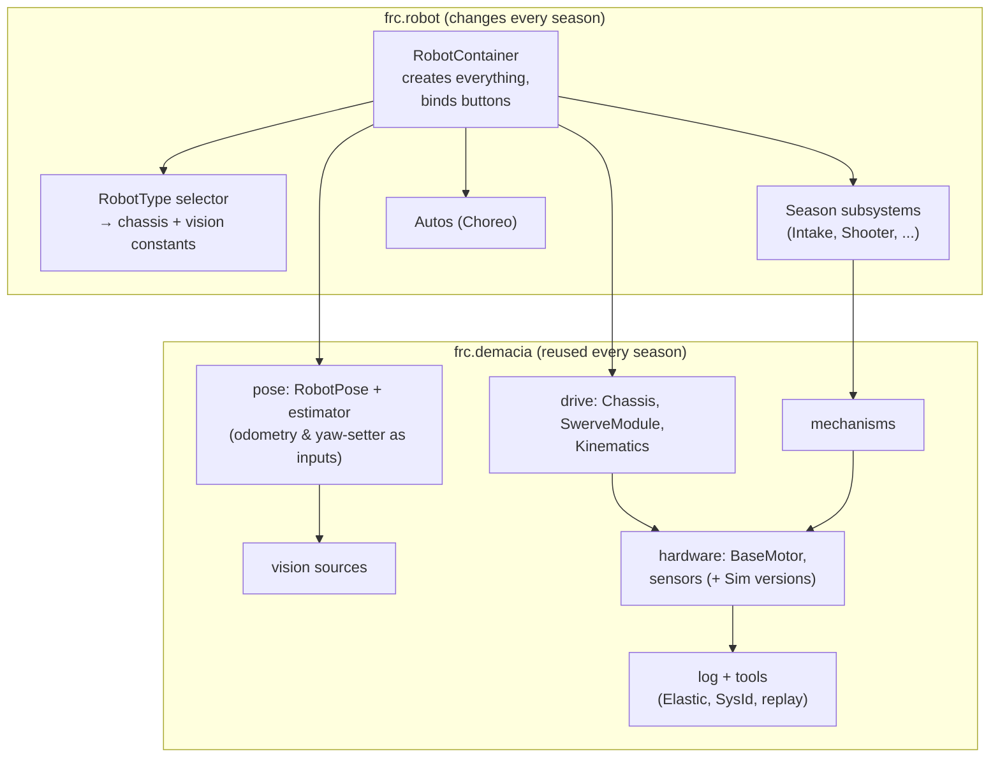

Every arrow points **down or sideways**, and nothing in `lib` points back to `season`.

---

## 13. Glossary

| Word | Meaning |
|------|---------|
| **roboRIO** | The computer on the robot that runs this code |
| **CAN bus** | The wire network that connects motor controllers and sensors. Each device has a **CAN ID**. A **CANivore** is a second, faster CAN bus |
| **Subsystem** | A robot part that owns hardware (chassis, arm...) |
| **Command** | An action that uses subsystems for some time |
| **Trigger** | A condition (usually a button) that starts or stops a command |
| **Duty cycle** | Motor power from -1 (full reverse) to 1 (full forward) |
| **PID** | A controller that corrects error: P = proportional, I = integral, D = derivative |
| **Feed-forward (kS, kV, kA, kG, kCos, kV2)** | Predicted voltage needed (static friction, velocity, acceleration, gravity, arm gravity × cos, velocity²), so PID has less work |
| **Motion Magic** | CTRE's built-in motion profile: moves to a position with limited velocity, acceleration and jerk |
| **SysId** | Measuring a mechanism to calculate its feed-forward constants |
| **Swerve** | A drivetrain where each wheel can point in any direction |
| **Odometry** | Estimating position from wheel encoders + gyro |
| **Pose** | Position (x, y) + heading (angle) on the field |
| **AprilTag** | A black-and-white square marker on the field. A camera can compute the robot's position from it |
| **MegaTag2** | Limelight's mode that uses the robot heading we send to compute a stable pose |
| **QuestNav** | Software that turns a Meta Quest headset into a position tracker for the robot |
| **STD (standard deviation)** | How noisy a measurement is. Smaller = more trusted |
| **NetworkTables (NT)** | How the robot and the dashboard share live values |
| **Elastic** | The dashboard app the team uses |
| **Singleton** | A class with exactly one instance, reached via `getInstance()` |
| **Template method** | A base class runs the steps in order and subclasses fill in some of them (`BaseMotor`) |
| **Builder pattern** | `new Config(...).withA().withB()` — chained setters that return `this` |
